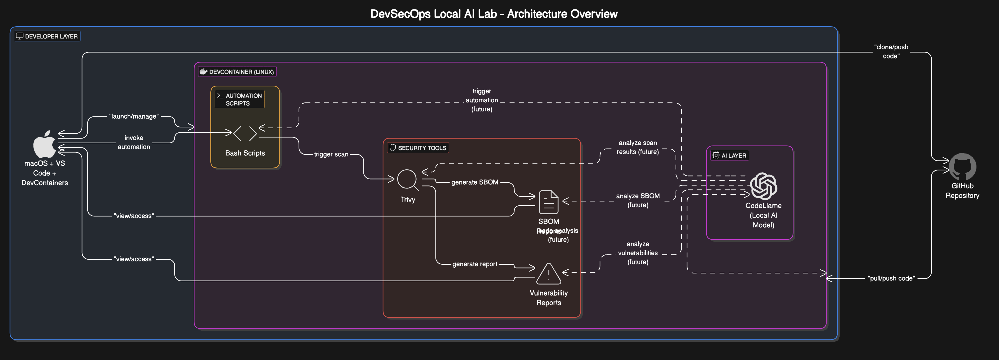

# DevSecOps Local AI Lab

## Overview
This project is a personal DevSecOps experiment designed to simulate secure development environments enhanced with local AI assistance.  
I built this lab to deepen my hands-on technical skills by integrating security scanning, SBOM generation, and AI-assisted coding inside a reproducible development container.

## Architecture
- Developer Workstation: macOS + VS Code + DevContainers
- DevContainer: Dockerized Linux with security and AI tools
- GitHub: Version control for code and security artifacts
- Security Tools: Trivy for scanning, SBOM generation
- Local AI Model: CodeLlama served via Ollama (future enhancement)

## Workflow Summary
- DevContainer spun up locally for isolated, reproducible development.
- Trivy used for vulnerability scanning and SBOM generation.
- Vulnerability findings manually reviewed and triaged.
- Bash scripts created for automated scans and SBOM breakdowns.

## Findings and Remediation Summary
During the initial vulnerability scans using Trivy, several medium and high-severity issues were discovered in the containerized environment. Specifically, the scan surfaced **2 high-severity** and **5 medium-severity** vulnerabilities, primarily related to outdated system libraries inherited from the base image. After reviewing the criticality and exploitability, I manually remediated one high-severity vulnerability by updating the affected package in the Dockerfile. The remaining findings, primarily low-risk or internal-use-only components, were documented for future patching as part of a continuous improvement process. SBOMs were generated for full component visibility and will serve as a baseline for monitoring future drift.

Trivy was chosen as the scanning tool for its lightweight design, ease of integration inside DevContainers, and strong support for both filesystem and container image scanning. The decision to scan the development container itself was based on real-world DevSecOps practices, where even local developer environments can introduce risks if vulnerabilities are overlooked. Treating the container as a "mini production system" helped simulate how security scanning would fit into a real CI/CD pipeline.

## Folder Structure
```plaintext
/ (root)
├── bash-scripts/           # Helper scripts for SBOM and Trivy scans
│   ├── sbom_breakdown.sh
│   ├── scan_trivy.sh
│   └── trivy_scan.sh
├── devcontainer/           # DevContainer configuration (VS Code)
│   ├── devcontainer.json
│   └── Dockerfile
├── dockerfiles/            # Dockerfiles for security scan targets
│   ├── Dockerfile.dvwa
│   ├── Dockerfile.juiceshop (in progress)
│   └── legacy-app.Dockerfile
├── docs/                   # Placeholder for architecture diagrams
├── reports/                # Vulnerability scan and SBOM outputs
│   ├── legacy_vuln_report.txt
│   ├── nginx_vuln_report.txt (in progress)
│   └── sbom_YYYYMMDD.json
├── .gitignore
├── LICENSE
└── README.md

Status Note

This lab is currently an MVP (Minimum Viable Project). Some folders such as dockerfiles and docs are placeholders for future expansion.

The current focus was to create real-world security scan outputs, practice vulnerability management, and integrate SBOM generation as a foundation for future DevSecOps pipelines. Future commits will include populated Dockerfiles for JuiceShop, enhanced AI integration, and GitHub Action-based scan automation.

Lessons Learned
	•	Overcoming imposter syndrome by shipping small but real technical artifacts.
	•	Gaining confidence with container security scanning and SBOM management.
	•	Using local tools like Trivy and DevContainers to simulate production-grade practices.

Future Improvements
	•	Automate Trivy vulnerability scans via GitHub Actions.
	•	Populate additional container targets (JuiceShop, OWASP NodeGoat).
	•	Integrate local AI assistant inside the container for secure code generation.
	•	Enrich SBOMs with metadata (licenses, vulnerabilities) for deeper analysis.

## Architecture Diagram



> *Note: CodeLlama (Local AI Model) is already integrated inside the DevContainer for real-time AI-assisted development.*

Acknowledgements

Thanks to the open-source communities behind Trivy, CycloneDX, DevContainers, and Ollama for making security innovation accessible to builders like me.